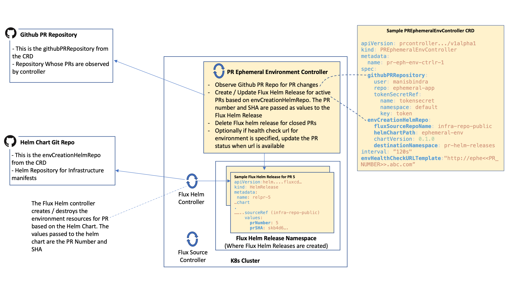
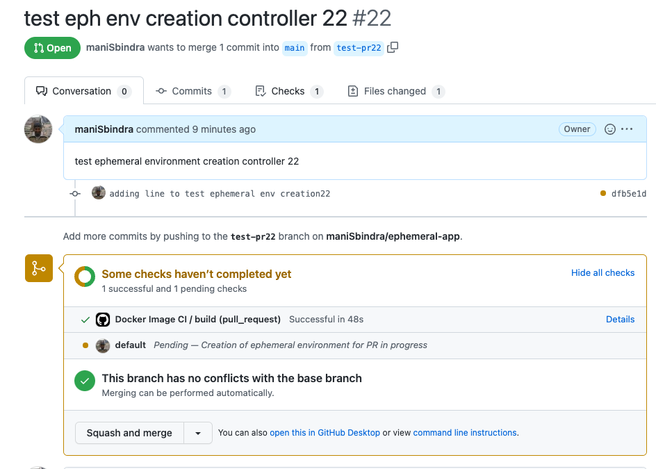
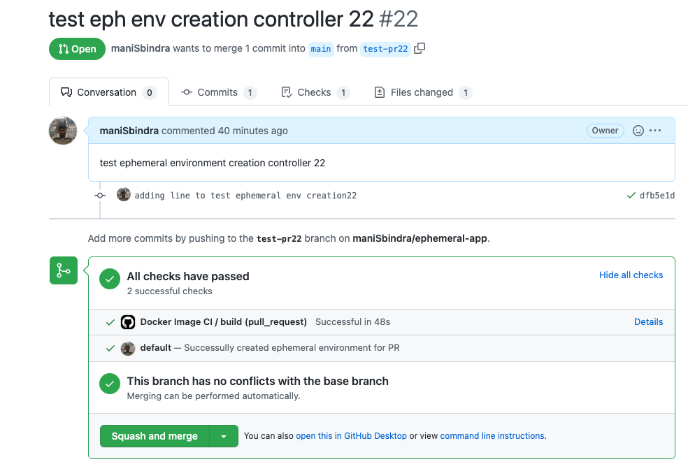
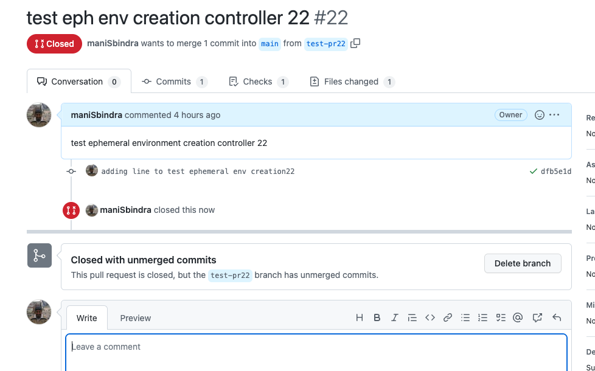

# pr-ephemeral-env-controller

The Ephemeral environment PR controller is a custom controller which can be configured using a CRD, to observe the application repository (githubPRRepository in CRD) for new PRs and changes to existing PRs. If a new PR is created, the controller creates a new Flux Helm Release, with reference to the the Helm Chart Repository (envCreationHelmRepo in CRD) to be used to create ephemeral environment resources for the PR, as well PR Number and PR SHA to be passed as values to the Helm Chart. 
The Helm chart needs to make use of the PR Number and PR SHA values supplied, to create appropriate resource names, and pull specific container images that may be needed for the ephemeral environment creation. You can design your Helm Chart to create a new environment in separate Namespace for each PR, or totally isolated (including isolated cloud services) environments for each PR. The Flux Helm Controller then generates manifests specific to the PR and applies them on the Kubernetes cluster. 

The configuration of this controller is based on configuration of a Github [Pull Request Generator](https://argo-cd.readthedocs.io/en/latest/operator-manual/applicationset/Generators-Pull-Request/) with an Argo CD ApplicationSet.

## PR Ephemeral Environment Controller Overview



### Controller Configuration

Sample PREphemeralEnvController Resource (from the [file](./docs/sample-pr-eph-env-controller-with-healthcheck.yaml) )

  ```
apiVersion: prcontroller.controllers.ephemeralenv.io/v1alpha1
kind: PREphemeralEnvController
metadata:
  name: pr-eph-env-ctrlr-1
spec:
  githubPRRepository:
    user: manisbindra
    repo: ephemeral-app
    tokenSecretRef: 
      name: tokensecret
      namespace: default
      key: token
  envCreationHelmRepo:
    fluxSourceRepoName: infra-repo-public
    helmChartPath: ephemeral-env
    chartVersion: 0.1.0
    destinationNamespace: pr-helm-releases
  interval: "60s"
  envHealthCheckURLTemplate: "http://ephenvtestpr<<PR_NUMBER>>.eastus.cloudapp.azure.com"
  ```

* githubPRRepository: The controller observes this repository for pull request changes, and accordingly makes changes that create, update or delete the ephemeral environment associated with the PR
  * user: is the user or organization owning the repository
  * repo: the name of the repository
  * tokenSecretRef: specifies the details about the kubernetes secret which contains the Github PAT token using which the controller can access the Github Repository and observe if for changes to PRs. The secret needs to be configured to enable the controller to do its job
* envCreationHelmRepo: This references the Helm Chart which will be used as template to provision infrastructure for each PR
  * fluxSourceRepoName: This is the Flux Source repository name, which points to Helm Chart repository. This Flux Source needs to exist to enable provisioning of ephemeral environment for the PR. For the example shown above, the "infra-repo-public" was created as follows:
    
    ```
      export GITHUB_INFRA_REPOSITORY="https://github.com/maniSbindra/ephemeral-env-infra"
      flux create source git infra-repo-public \
        --url ${GITHUB_INFRA_REPOSITORY} \
        --branch "main" \
        --username=${GITHUB_USER} --password=${GITHUB_TOKEN}
    ```

  * helmChartPath: Folder path to the helm chart
  * destinationNamespace: The controller creates a Flux HelmRelease for each new PR. The Flux HelmReleases are created in this namespace. This namespace needs to exist on the cluster. The default option when you create multiple PREphemeralEnvController's should be to have distinct destinationNamespace's for each to avoid any overlap of resource names.
* envHealthCheckURLTemplate: This is an optional field. If not specified then as soon as Flux HelmRelease is created for a PR the status on the Github Pull Request (for the Head SHA), is set to "success". If this field is set, then the controller sets the status of the PR to "pending" when it initially creates the Flux HelmRelease, after which it continuously monitors the healthcheck endpoint, and when that endpoint returns an HTTP 200 response code, the controller sets the Github PR status to "success". The symbols **<<PR_NUMBER>>** and **<<PR_HEAD_SHA>>** are replaced by the PR Number and PR SHA respectively


### Whats happens in the controllers reconcilliation loop
For each PREphemeralEnvController resource created in the cluster, the controller 
* Fetches the Github PAT token for the Github repo referenced in the githubPRRepository section of the PR, and gets all active PRs. Then
  * For PRs where no Flux HelmRelease exists, the controller creates a new Flux HelmRelease. The HelmRelease created points to Chart specified in the envCreationHelmRepo section of the CRD. The HelmRelease is configured to pass PR Number and PR SHA as values to the Helm Chart.
  * For PRs where the commit SHA has changed, the Flux HelmRelease is updated to reflect this
  * For Flux HelmRelease's in the destinationNamespace, for Whom no active PR exists, The Flux HelmRelease is deleted
  * If environment is ready for an active PR (if healthcheck is configured), then the controller updates the Github Pull request Status with a message that, Environment for the PR is ready
* Note: The Flux Helm Controller takes care of installing / updating / deleting ephemeral environment manifests (Specific to the PR) on the cluster, as HelmReleases are created, updated and deleted
* The controller continuosly writes events for PREphemeralEnvController resources. These events includes all events like HelmRelease created, updated, evnrionment ready etc

## Creating isolated ephemreal environmens with isolated Kubernetes (AKS) cluster, and isolated Postgres Database (Azure Postgres), and the Application with PR changes deployed to that cluster

The [Sample PREphemeralEnvController Configuration](#controller-configuration) on this page creates a new Ephmeral environment for each PR to the [sample application repository](https://github.com/maniSbindra/ephemeral-app). This is a simple todo API (CRUD for todo items), the tech stack is Java / Springboot, and the application needs a backend postgres database. In this case for each PR several resources are created, including a new resource group, a new AKS cluster on which the application deployement and service (corresponding to the PR SHA commit of the application) are created, a new Azure Postgres backend database to which the application points to read and persist data. To try this out you can bootstrap your Kubernetes cluster using these [steps](https://github.com/maniSbindra/ephemeral-mgmt/tree/main/mgmt-server-install-with-flux)   

## Installation 
For Installation instructions check [Installation](docs/Installation.md)

## Controller in Action
Once the controller has been installed on the cluster, and the PREphemeralEnvController resource created, the controller will starting observing the Github Repository for PR changes. Let us see how the controller handles environment creation and deletion.

### Environment Creation

* Initially when no PRs have been created we should see an event with message "No active PRs found" when describing the prcontroller-sample resource
  
  ```
  $ kubectl describe prcontroller prcontroller-sample | tail -n 5 
  Events:
  Type    Reason       Age                    From                     Message
  ----    ------       ----                   ----                     -------
  Normal  NoActivePRs  3m15s (x263 over 16h)  prcontroller-controller  No active PRs found
  ```

  There should also be not Flux Helm Release resources in the pr-helm-releases namespace

  ```
  $kubectl get helmrelease -A
    No resources found
  ```
  
* Let us now create a PR against the application Repo (https://github.com/maniSbindra/ephemeral-app.git). Once a PR has been created, we should see a new event in the prcontroller.
  Once a PR is created on Github
  In this case our PR has PR number: 22 and commit SHA short hash: dfb5e1d. After the PR creation we see the following events taking place
   
   
   As we can see from the Github PR, the progress indicator is an amber circle (next to the PR commit sha), indicating that checks are in progress. When we look at the details of the checks we see that "Creation of ephemeral environment for PR in progress"

   When we describe the controller, we see a new event with message "New flux HelmRelease created for PR 22" as shown below

   ```
   $kubectl describe prcontroller prcontroller-sample | tail -n 5
    
    Events:
      Type    Reason                  Age                    From                     Message
      ----    ------                  ----                   ----                     -------
      Normal  NoActivePRs             5m55s (x323 over 17h)  prcontroller-controller  No active PRs found
      Normal  FluxHelmReleaseCreated  113s                   prcontroller-controller  New flux HelmRelease created for PR 22
   ```

   We also see a Flux Helm Release for the PR
   
   ```
   $ kubectl get helmrelease -A                                    
      NAMESPACE          NAME       AGE   READY   STATUS
      pr-helm-releases   relpr-22   29m   True    Release reconciliation succeeded
   ```

  

* Once the environment is ready (based on health check), we see that the Github PR status (associated with the commit sha) is now a green tick, and in the details we see "Successfully created ephemeral environment for PR". This happens once the controller has verified that the service endpoint associated with the ephemeral environment is ready. Below is the screenshot
  

  At this point we also see the event informing us that a Flux Helm release exists for the PR and is up to date, and if the application API is ready we will also see an EnvReady event.

  ```
  $ kubectl describe prcontroller prcontroller-sample | tail -n 7
  Events:
  Type    Reason                  Age                  From                     Message
  ----    ------                  ----                 ----                     -------
  Normal  NoActivePRs             46m (x323 over 18h)  prcontroller-controller  No active PRs found
  Normal  FluxHelmReleaseCreated  42m                  prcontroller-controller  New flux HelmRelease created for PR 22
  Normal  FluxHelmReleaseCreated  116s (x40 over 41m)  prcontroller-controller  Flux HelmRelease already exists for PR and is up to date, PR 22
  Normal  EnvReady                31s (x37 over 3h37m)  prcontroller-controller  Environment is ready for PR 22
  ```

### Environment Deletion

Let us now close the PR in Github



After a while the FluxHelmRelease is deleted, along with the corresponding Azure resources.

The Controller event will now again show that there are no active PRs

```
$ kubectl describe prcontroller prcontroller-sample | tail -n 7
  Events:
  Type    Reason                  Age                    From                     Message
  ----    ------                  ----                   ----                     -------
  Normal  EnvReady                20m (x140 over 3h52m)  prcontroller-controller  Environment is ready for PR 22
  Normal  FluxHelmReleaseCreated  15m (x156 over 4h4m)   prcontroller-controller  Flux HelmRelease already exists for PR and is up to date, PR 22
  Normal  NoActivePRs             9s (x340 over 21h)     prcontroller-controller  No active PRs found
```

  